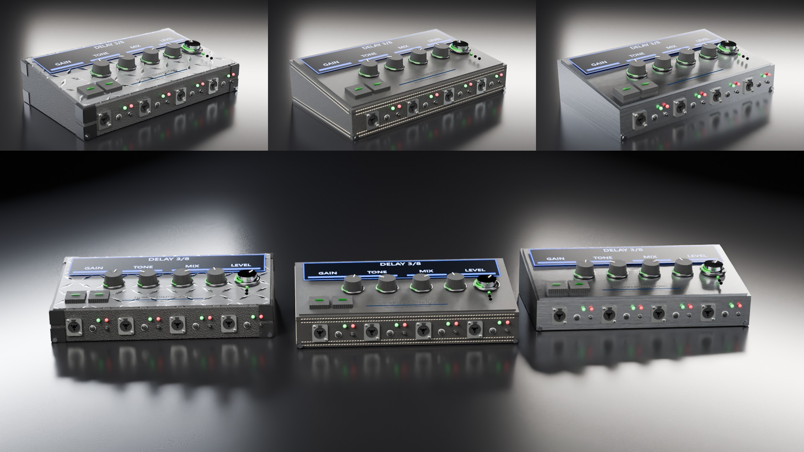

# Hybrid Matrix – 3D fémdoboz, Higgsfield reklámcsomag

Forrásdizájn: [`alexanderjudin-cpu/3d-femdob-textura-variaciok`](https://github.com/alexanderjudin-cpu/3d-femdob-textura-variaciok)
(`Hybrid Matrix - Fém felületek.html`, 380 × 220 × 85 mm-es ék alakú ház).

A három kért felületet a dizájn saját 3D nézegetőjéből exportáltam pontos GLB-be (ugyanaz a geometria, csatlakozók,
LED-gyűrűs gombok, kijelző, varrások és sarokvédők), majd Blender Cycles-ben stúdiófényben rendereltem.

## A három verzió

| Verzió | Mappa | Felület |
|---|---|---|
| **Csiszolt acél (Poliigon)** | `renders/steel/` | Poliigon *MetalSteelBrushed 7174* PBR készlet, vízszintes szálcsiszolás, anizotróp csillanás |
| **Fekete bőr, varrott** | `renders/leather/` | Fekete, finom szemcséjű bőr, enyhe viaszos fény, krém nyeregvarrás minden panelélen |
| **Erősítőfej: tolex + bordás alulemez** | `renders/amphead/` | Fekete pebble tolex ház, polírozott alumínium gyémántmintás (bordás) fedlap, fekete ABS sarokvédők |

Mindegyiken a dizájn alapbeállításai vannak: zöld LED-gyűrűk, kék kijelző, fekete bordázott gumigombok.

## Képek verziónként (Higgsfield-be ezek tölthetők fel)

| Fájl | Méret | Mire jó |
|---|---|---|
| `<verzió>_hero.jpg` | 1920×1080 | Fő termékkép, 3/4 nézet balról – start vagy end frame |
| `<verzió>_dark.jpg` | 1920×1080 | Ugyanaz a nézet, csak kontúrfény + LED-ek – „sötétből előjövés” start frame |
| `<verzió>_orbit.jpg` | 1920×1080 | 3/4 nézet jobbról – a körbefordulás end frame-je |
| `<verzió>_macro.jpg` | 1920×1080 | Sarok-közeli: anyag, varrás/szálcsiszolás/gyémántlemez, csatlakozó |
| `<verzió>_top.jpg` | 1920×1080 | Felülnézeti makró a gombokra és a kijelzőre |
| `<verzió>_vertical.jpg` | 1080×1920 | Álló 9:16 – Reels/TikTok/Shorts |
| `renders/lineup.jpg` | 1920×1080 | Mindhárom verzió egymás mellett – záróképnek |

Letöltés: **`higgsfield-csomag.zip`** (mindhárom verzió + zárókép + promptok), illetve verziónként
`higgsfield-csomag-amphead.zip`, `higgsfield-csomag-leather.zip`, `higgsfield-csomag-steel.zip`.

Mindhárom verzió képei a Higgsfield-fiókba is be vannak importálva (Media → Images, `amphead_…`, `leather_…`, `steel_…`).

## Higgsfield lépésről lépésre

1. Töltsd le a `higgsfield-csomag.zip`-et, csomagold ki.
2. Higgsfield → **Video** → modell: **Kling 3.0** (mód: `pro`, hang: `off`). 1080p-hez: **Seedance 2.5**, `1080p`.
3. A `higgsfield/PROMPTOK.md`-ből válassz egy jelenetet: töltsd fel a megadott **Start frame** (és ha van, **End frame**) képet,
   másold be a promptot, állítsd be az időtartamot (3 vagy 5 mp) és a képarányt.
4. Generálj 2–4 változatot, a legjobbat tartsd meg.

**Ha a tárgy egyáltalán nem változhat** (csak a fények), a `PROMPTOK.md` elején lévő „Csak fény” promptot használd
`_dark` → `_hero` start/end képpárral, 3 mp, fix kamerával, kikapcsolt *Enhance prompt*-tal.

Jelenetek (mindhárom verzióhoz megvan a kész prompt):

| ID | Hossz | Képek | Mozgás |
|---|---|---|---|
| A_reveal | 3 mp | `dark` → `hero` | Fények felkapcsolnak, a doboz előjön a sötétből |
| B_orbit | 5 mp | `hero` → `orbit` | 75°-os kameraív balról jobbra |
| C_macro | 3 mp | `macro` | Lassú slider + élességáthúzás az anyagon |
| D_knob | 3 mp | `top` | A gomb magától elfordul, a LED-ív nő |
| E_vertical | 5 mp | `vertical` | Álló reel: lassú ráközelítés + kis ív |
| F_lineup | 5 mp | `lineup` | Mindhárom verzió, ráközelítés a középsőre |

### 15 mp-es reklám vágási terve

| Idő | Klip |
|---|---|
| 0–3 mp | A_reveal – erősítőfej |
| 3–6 mp | C_macro – bőr (varrás) |
| 6–9 mp | B_orbit – acél (első 3 mp) |
| 9–11 mp | D_knob – bármelyik |
| 11–15 mp | F_lineup + felirat: **HYBRID MATRIX** |

## Már legenerált videók

Az erősítőfej verzió 5 klipje (Kling 3.0 pro): `higgsfield/GENERALT-VIDEOK.md`.

## 3D modellek

`models/hybrid-matrix-<verzió>.glb` – könnyített GLB (2K textúrák), Higgsfield 3D jelenetépítőbe vagy bármilyen
3D programba importálható. (A bőr GLB a nézegető saját szemcsetextúráját hordozza; a renderekben látható finomabb
bőrszemcse és a krém varrás színe Blenderben, procedurálisan készült.)

## Újragenerálás

- `scripts/export.mjs` – Playwright-tal megnyitja a dizájn nézegetőjét, kiválasztja a felületet és GLB-t exportál.
- `scripts/hm_render.py` – Blender (bpy) Cycles stúdiórender; `python3 hm_render.py -- <steel|leather|amphead|lineup> <glb> <kimenet> <shotok> [skála] [minták]`.
- `scripts/make_prompts.py` – a `higgsfield/prompts.json`-ból elkészíti a `higgsfield/PROMPTOK.md`-t.
